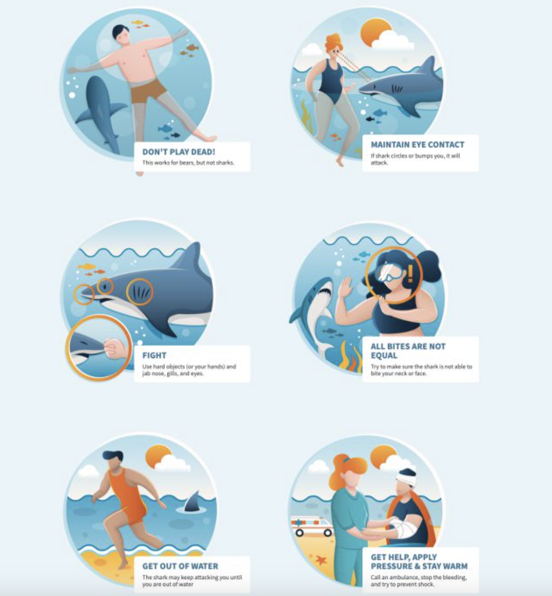

# 1er proyecto de limpieza de datos: Ataques de tiburones

## Descripción del proyecto

Proyecto de limpieza de datos segunda semana bootcamp.
Partimos de un CSV que tiene 25723 filas y 24 columnas. 
Al final de nuestra limpieza deben quedar al menos 2500 filas y 23 columnas.

1) Importar las librerías que creo que necesitaré para realizar la lipieza de datos, los gráficos, etc

2) Carga del DCV de donde extraemos los datos

3) Limpieza global de datos

  -Exploración y eliminación de duplicados
  
  -Corrección de nombres de columnas
  
  -Exploración de valores nulos
  
  -Reemplazo de valores nulos donde sea necesario
  
  -Eliminación de valores nulos en columnas donde no puedo tener nulos
  
  -Exploración más en detalle de algunas columnas, y posterior reemplazo o eliminación de valores nulos
        
4) Limpieza de datos de las columnas elegidas para mi análisis
  
  -Exploración y limpieza columna SEX
  
  -Exploración y limpieza columna FATAL
  
  -Exploración y limpieza columna COUNTRY

5) Análisis y Conclusiones Globales
  
  -Países con más casos
  
  -Porcentaje de fatalidad a nivel global
  
  -Género de las víctimas a nivel global
    
6) Análisis y conclusiones en los 3 países más afectados
  
  -USA: Fatalidad y género de las víctimas
  
  -AUSTRALIA: Fatalidad y género de las víctimas
  
  -SUDÁFRICA: Fatalidad y género de las víctimas
    
7) Finalmente unas recomendaciones por si te encontrás con un tiburón... sobre todo si sos hombre y estás en USA, Australia o Suáfrica

    
    
